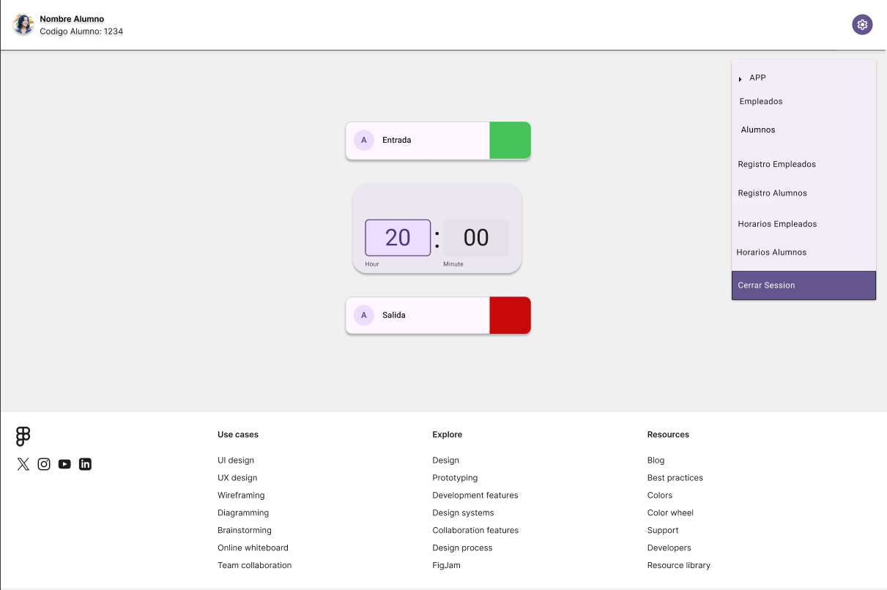
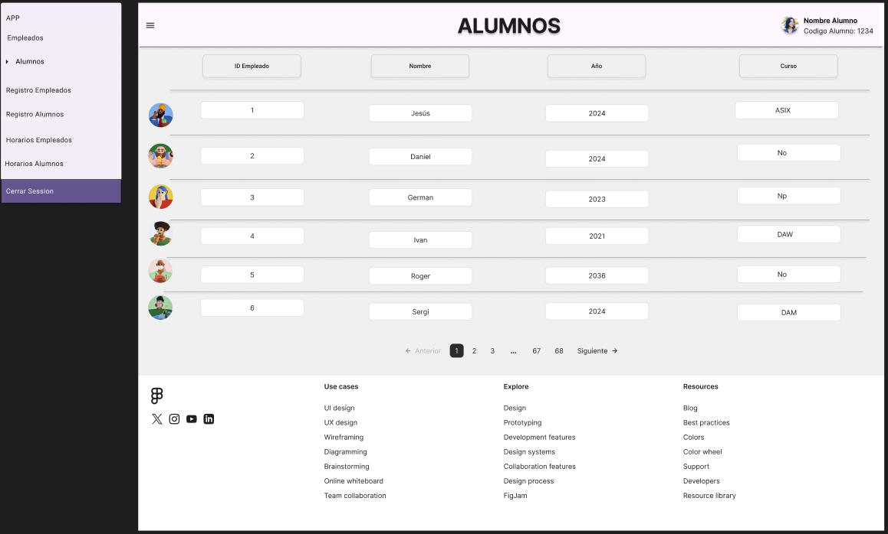

# ProyectoJPM - DAW

### [FIGMA] Wireframe d’aplicació web

-CAPTURA REGISTRO WEB APP.

    -Explicación: Aqui mostramos un formulario sencillo para crear un nuevo usuario.

    -CAPTURA LOGIN.

    -CAPTURA APP WEB(BASE BETA)

    -Explicación: Como podemos ver el funcionamiento es sencillo, una vez que el usuario pase la targeta por el aparato detectará que esa targeta esta asociada
    a un codigo de trabajador/estudiante, se le abrirá la web que veis en la imagen, podrá fichar su entrada dandole al botón verder, cuando finalice su jornada lo mismo tendrá que darle al boton rojo, todo esto quedará registrado en la base de datos, cada uno de los movimiento que se hagan, ya sea entrada o salida.

    -El submenú que se ve arriba a la derecha podremos ver que tiene diferentes apartados, uno de ellos es APP que es basicamente lo que hemos visto en la anterior captura,
    Fichajes tengo pensado en poner un listado(solicitado desde una BDD) donde muestre todos y cada una de las personas que han fichado en el turno de trabajo.

    -Los horarios, estoy aun terminando de ver si será una plantilla donde estarán solo los profesores o alumnos..

    -Los retrasos serán un listado con cada una de las personas que fichen tarde la hora de entrada.

    -Evidentemente esto es una BETA, ya que las librerias de FIGMA limitan un poco a la hora de crear apartados.

### Apartado: Empleados

    -Explicacion: Lo que hemos pensado en implementar en esta seccion de aquí es lo más esencial, IdEmpleado, Nombre y Rol, ya que creemos que es la información mas relevante hasta el momento que podamos aportar, ya que dentro de los empleados del centro habrá de todo, profesores, cordinadores, Cap de estudis etc...

### Apartado: Alumnos

    -Explicación: Lo que hemos implementado en esta sección de aqui es basicamente el ID_alumno, nombre, el año el cual entro y la rama IT que está cursando.

### Apartado: Registro Empleados

    -Explicación: En este apartado de aquí lo hemos tenido muy claro, hemos implementado la ID_Empleado, Hora Entrada, Espacio, Hora salida y Horas totales, creemos que son lo datos más importantes de esta sección.

### Apartado: Registro Alumnos

    -Explicación: En este apartado hemos hecho exactamente que en el registro de empleados.

### Apartado: Horarios Empleados

    -Explicación: En este apartado hemos querido hacer lo siguiente, si nos fijamos en la parte superior aparecen los 7 días de la semana incluido el domingo y con los numeros del mes,
    luego tenemos la imagen de cada uno de nuestros empleados, y debajo de cada día su respectivo horario de ese día.
    Aun nos falta por pulir una serie de detalles que tenemos que contemplar para conseguir proximas versiones de la misma.

### Apartado: Horarios Alumnos

    -Explicación: Aqui hemos replicado exactamente(de momento) el mismo patrón que con los empleados hasta que tengamos una idea clara de como quedará a nivel de diseño y funcional este apartado.

### [App] Java X Amazon Web Service.
